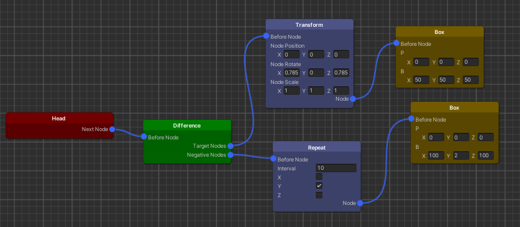

# SDF-Editor
s1260201 GT

 SDF (Signed Distance Field) modeling is a better  method for rendering curves than polygon modeling. In this research, I’ll implement SDF-based modeling system to make easier in Unity.
 

# Features
* Node based UI: Library of 3D primitives, operations.
* Define models by graph, not by programs.
* Should be able to generate shader code corresponding to the graph.
* Use ray-marching for real-time rendering. Blend the rendered model with the rest of the scene (“impostor”).

# How to use
1. Connecting nodes

2. Exporting shader

 

Link
https://github.com/Siccity/xNode/releases/tag/1.7
