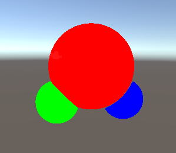

# SDF-Editor
s1260201 GT

This motivation is exact?

 SDF (Signed Distance Field) modeling is a better  method for rendering curves than polygon modeling. In this research, I’ll implement SDF-based modeling system to make easier in Unity.
 

How to use

1. Connecting nodes

2. Exporting shader

 

Link
https://github.com/Siccity/xNode/releases/tag/1.7
